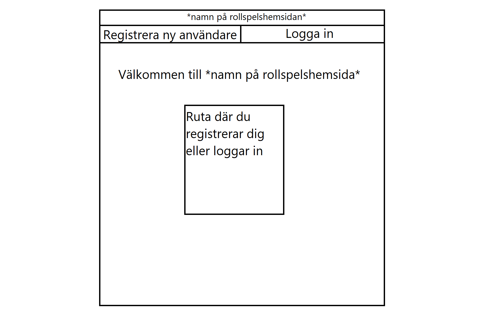
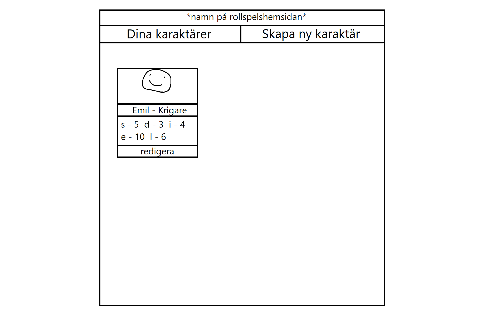
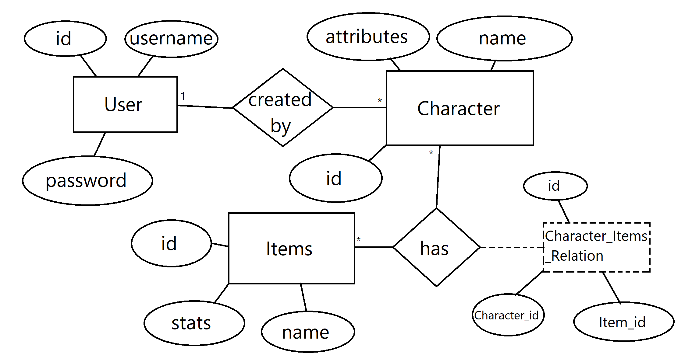

# Projektplan

## 1. Projektbeskrivning (Beskriv vad sidan ska kunna göra).

På sidan ska man kunna skapa ett konto där man kan skapa karaktärer som man ska använda för rollspel. Karaktärerna ska ha porträtt, olika attribut och namn. Dessutom ska karaktärerna kunna äga utrustning, bl.a vapen. Allt som karaktärerna äger ska dessutom ha egna namn, bilder och attribut.

## 2. Vyer (visa bildskisser på dina sidor).

## 3. Databas med ER-diagram (Bild på ER-diagram).

## 4. Arkitektur (Beskriv filer och mappar - vad gör/innehåller de?).

